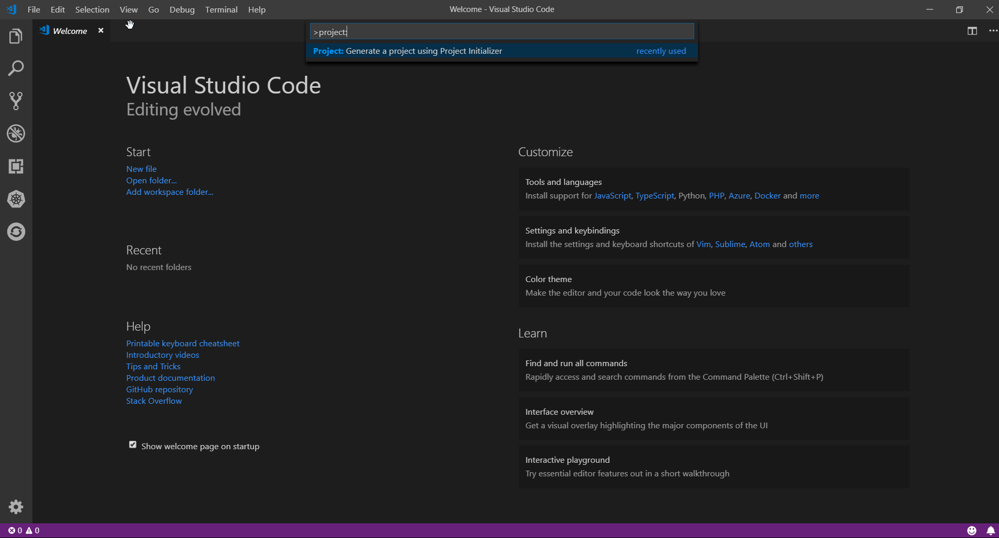

# Project Initializer

## Overview

A lightweight extension based on Red Hat Launcher to generate quickstart projects using Visual Studio Code (VS Code). Here's a list of features:

- Generator

## Requirements

- VS Code (version 1.19.0 or later)

## How-to

First you need to "open the folder" in VS Code in which you want to create the project.

Then, you can trigger the Project Initializer. It is available from Palette command (Ctrl+Shift=P) with the name "Project: generate a project using Project Initializer":

## Extension Settings

* `project.initializer.endpointUrl`: launcher service endpoint URL. Defaults to https://forge.api.openshift.io/api/
* `project.initializer.defaultGroupId`: default group id. Defaults to io.openshift
* `project.initializer.defaultArtifactId`: default artifact id. Defaults to booster
* `project.initializer.defaultVersion`: default version. Defaults to 0.0.1-SNAPSHOT

## Known Issues

None at this point.

## Release Notes

### 0.0.1

First version for early feedback

### 0.0.2

First missing dependency

### 0.0.3

Update for new Launcher API

### 0.0.4

Endpoint URL, default groupID, artifactId and version settings

### 0.0.5

Fix typo in default endpoint URL causing catalog loading error

### 0.0.6

Files are now extracted at the root of the workspace folder

### 0.0.7

Add VSCode recommendation files to generated projects

### 0.0.8

Switch to Project Initializer

